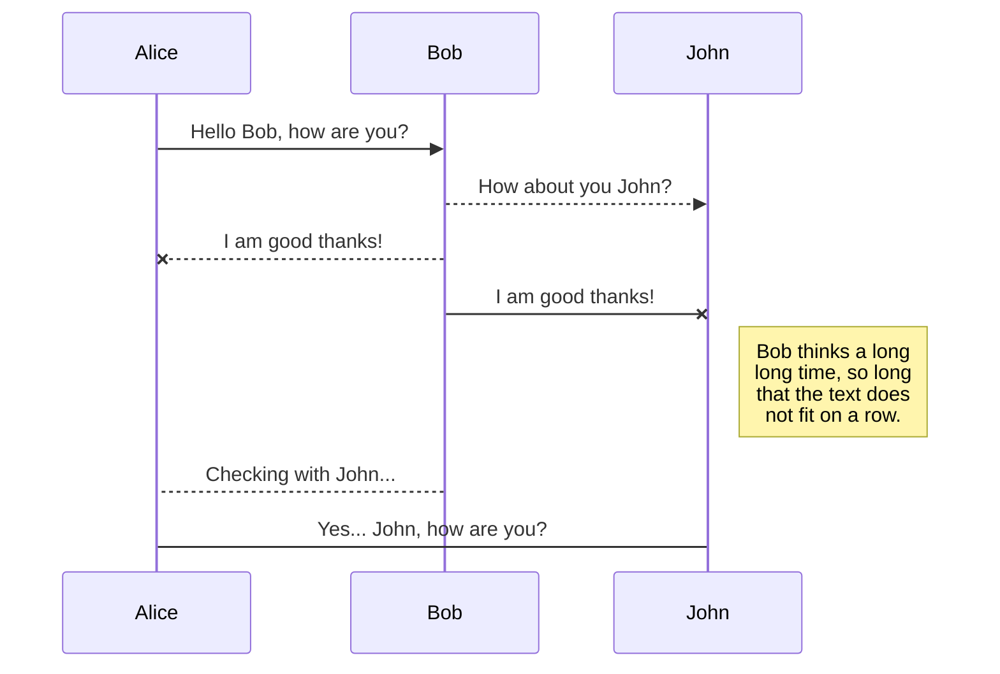
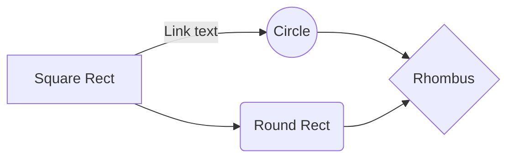

# Kaffa - Pre-qualification test (v1.8)

## Notes

Third Libraries:

- Axios (https://github.com/axios/axios)
- Moment (https://momentjs.com/)

## Exercises

Answer the exercises following the criteria:

- Presentation of the content
- Correctness of the solution
- Code organization
- Techniques and practices
- Complexity sof the exercises
- Time to completion

## 1) Validate CNPJ format (Mask)

Given a string, check if it looks like a CNPJ, considering two formats:

- Formatted:
  `"00.000.000/0000-00"`

- Number only:
  `"00000000000000"`

```javascript
// validate CNPJ format only

checkFormatCNPJ:  function (cnpj) {
	var  re_cnpj_formated = /^\d{2}\.\d{3}\.\d{3}\/\d{4}\-\d{2}$/;
	var  re_cnpj_number_only = /^\d{14}$/;
	if (re_cnpj_formated.test(cnpj) || re_cnpj_number_only.test(cnpj)) {
		return  true;
	} else {
		return  false;
	}
},
```

## 2) Validate CNPJ digits

Given a string validate if it’s a well-formed CNPJ, considering the “check digits” as defined by Receita
Federal.
**Important**: Don’t use a library. You should write the validation code.

```javascript
validDigits:  function (cnpj) {
	if (cnpj.length == 0) return  false;

	// clear string
	cnpj = cnpj.replace(/\D/g,'');

	// Eliminates known invalid CNPJs
if (cnpj == "00000000000000" ||
	cnpj == "11111111111111" ||
	cnpj == "22222222222222" ||
	cnpj == "33333333333333" ||
	cnpj == "44444444444444" ||
	cnpj == "55555555555555" ||
	cnpj == "66666666666666" ||
	cnpj == "77777777777777" ||
	cnpj == "88888888888888" ||
	cnpj == "99999999999999")
	return  false;

	// Check DVs

	vsize = cnpj.length - 2
	vnumber = cnpj.substring(0,vsize);
	vdigits = cnpj.substring(vsize);
	vsum = 0;
	pos = vsize - 7;

	for (i = vsize; i >= 1; i--) {
		vsum += vnumber.charAt(vsize - i) * pos--;
		if (pos < 2) pos = 9;
	}
	vresult = vsum % 11 < 2 ? 0 : 11 - vsum % 11;
	if (vresult != vdigits.charAt(0))
		return  false;

	vsize = vsize + 1;
	vnumber = cnpj.substring(0,vsize);
	vsum = 0;
	pos = vsize - 7;

	for (i = vsize; i >= 1; i--) {
		vsum += vnumber.charAt(vsize - i) * pos--;
		if (pos < 2) pos = 9;
	}

	vresult = vsum % 11 < 2 ? 0 : 11 - vsum % 11;
	if (vresult != vdigits.charAt(1))
		return  false;

	return  true;
},
```

## 3) Test if two rectangles intersect

Considering two rectangles in a discrete grid (like pixels in a display), each defined by two points, return
true if they intersect, false otherwise.
**Note**: _the points are **included** in the rectangle and have a dimension of 1 unit; the rectangle (0, 0; 1, 1) have an area of 4 units._

```javascript
// check intersection
intersects:  function(a, b) {
	if (Math.max(a.left, b.left) < Math.min(a.right, b.right) &&
			Math.max(a.top, b.top) < Math.min(a.bottom, b.bottom)) {
		return  true;
	} else {
		return  false;
	}
},
```

## 4) Compute area of intersection between two rectangles

Considering two rectangles in a discrete grid (like pixels in a display), each defined by two points, compute
the area of intersection between the two.
**Note**: _the points are **included** in the rectangle and have a dimension of 1 unit; the rectangle (0, 0; 1, 1) have an area of 4 units._

```javascript
//Not done
```

## 5) Simple Todo List

Todo list application that permits the creation and deletion of tasks (texts).

- The application must persist the tasks between executions;
- Use any storage you want: database, files, PaaS backends (Firebase, etc.);

```javascript
// add task
addTask:  function() {
	this.taskExists = false;
	const  taskNew = this.tasks.filter(task => task.name.toLowerCase() ==
			this.nameTask.toLowerCase()).length == 0;
	if (taskNew) {
		this.tasks.push({
			name:  this.nameTask,
			pending:  true
		});
		this.nameTask = '';
		this.taskExists = false;
	} else {
		this.taskExists = true;
	}
},

//delete task
removeTask:  function(i) {
	this.tasks.splice(i, 1);
},

// task done or pending
toggleTask:  function(i) {
	this.tasks[i].pending = !this.tasks[i].pending;
},
```

## 6) Rest Client - World Clock

Application that queries a server and displays the current date/time hour in local and UTC timezones.

Server URL: http://worldclockapi.com/api/json/utc/now

```javascript
getDateTimeFromAPI:  function() {
	axios.get('http://worldclockapi.com/api/json/utc/now').then(response  => {
		this.currentDateTime = response.data.currentDateTime;
		}).catch(error  => {
			console.log(error);
			this.errored = true
		}).finally(() =>  this.loading = false);
	},

	// format datetime
	format_date:  function(value){
		if (value) {
		return  moment(String(value)).format('DD/MM/YYYY HH:mm', "America/Brasilia");
		}
	},
```

## 7) Rest Server - World Clock

REST server returning a JSON like:

```json
{
  "currentDateTime": "2019­08­12T14:40Z"
}
```

    not done...

## 8) Entity Relationship Diagram - Simple Order Manager

Design the model of a simple Order Manager System.
The system consists of:

- Clients
- Products
- Orders
- Any other tables you may need

You can draw, describe, or list the tables as SQL.
Extras:

- SQL: list ORDERS with number of items
- Which indexes should be created in this model?
  **Important**: this exercise is documentation only - there’s no executable to run in this case.

You can render UML diagrams using [Mermaid](https://mermaidjs.github.io/). For example, this will produce a sequence diagram:



And this will produce a flow chart:


